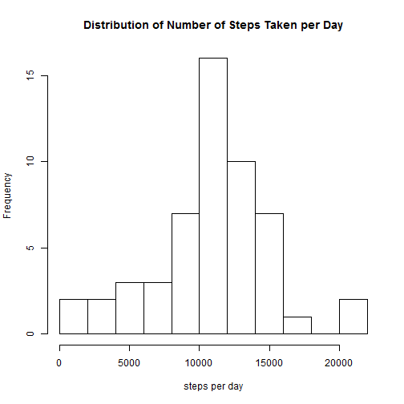
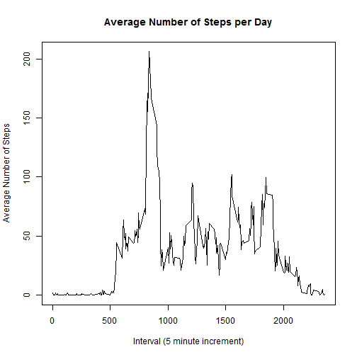
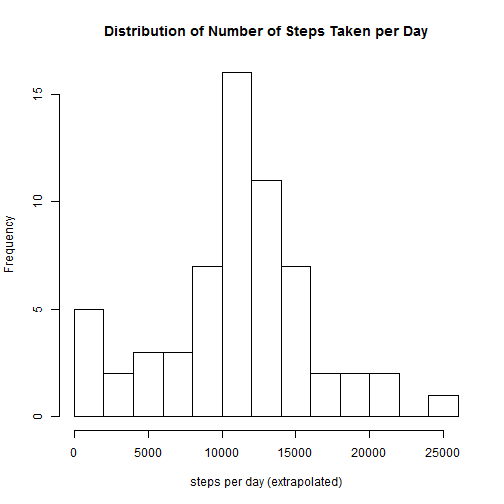

# Reproducible Research: Peer Assessment 1

## Loading and preprocessing the data


```r
fzip = "repdata-data-activity/activity.csv"
stepdat <- read.table(fzip, sep=",", stringsAsFactors=FALSE, as.is=TRUE, header=TRUE, na.strings="NA")
```

```
## Warning: cannot open file 'repdata-data-activity/activity.csv': No such
## file or directory
```

```
## Error: cannot open the connection
```

```r
stepdat$day <- as.Date(stepdat$date, "%Y-%m-%d")
stepdat.no_na <- data[!is.na(stepdat$steps),]
```

```
## Error: object of type 'closure' is not subsettable
```

```r
steps.per.day=xtabs(steps ~ day, data=stepdat.no_na)
```


## What is mean total number of steps taken per day?

### Make a histogram of the total number of steps taken each day

```r
h1 <- hist(steps.per.day, breaks=11, xlab="steps per day", main="Distribution of Number of Steps Taken per Day")
```

 

### Calculate and report the mean and median total number of steps taken per day

```r
mean(as.vector(steps.per.day)) # [1] 10766.19
```

```
## [1] 10766
```

```r
median(as.vector(steps.per.day)) # [1] 10765
```

```
## [1] 10765
```

## What is the average daily activity pattern?

### Make a time series plot (i.e. type = "l") of the 5-minute interval (x-axis) and the average number of steps taken, averaged across all days (y-axis)


```r
library(plyr)
steps.per.day.mean <- ddply(stepdat.no_na, .(interval), summarize, avg=mean(steps))
plot(steps.per.day.mean$interval, steps.per.day.mean$avg, type="l", 
    xlab="Interval (5 minute increment)",
    ylab="Average Number of Steps",
    main="Average Number of Steps per Day")
```

 
### Which 5-minute interval, on average across all the days in the dataset, contains the maximum number of steps?


```r
steps.per.day.mean[steps.per.day.mean$avg==max(steps.per.day.mean$avg),1] # [1] 835
```

```
## [1] 835
```

## Imputing missing values

### Calculate and report the total number of missing values in the dataset (i.e. the total number of rows with NAs)


```r
sum(is.na(stepdat$steps)) # [1] 2304
```

```
## [1] 2304
```

### Devise a strategy for filling in all of the missing values in the dataset. Replace missing values by the average for that interval


```r
tmpdat <- merge(stepdat, steps.per.day.mean, by="interval")
naidx = is.na(stepdat$steps)
stepdat$steps.extrapolated <- stepdat$steps
stepdat$steps.extrapolated[naidx] <- as.integer(tmpdat[naidx,"avg"])
```

### Create a new dataset that is equal to the original dataset but with the missing data filled in.


```r
stepdat.extrapolated <- stepdat[,c(5,2,3)]
colnames(stepdat.extrapolated) = c("steps","date","interval")
```

### Make a histogram of the total number of steps taken each day and Calculate and report the mean and median total number of steps taken per day. Do these values differ from the estimates from the first part of the assignment? What is the impact of imputing missing data on the estimates of the total daily number of steps?


```r
stepdat.extrapolated$day <- as.Date(stepdat.extrapolated$date, "%Y-%m-%d")
steps.per.day.ex=xtabs(steps ~ day, data=stepdat.extrapolated)
h2 <- hist(steps.per.day.ex, breaks=11, xlab="steps per day (extrapolated)", main="Distribution of Number of Steps Taken per Day")
```

 

```r
mean(as.vector(steps.per.day.ex)) #  [1] 10871.98 versus 10766.19 before extrapolation
```

```
## [1] 10872
```

```r
median(as.vector(steps.per.day.ex)) # [1] 11015 versus 10765 before extrapolation
```

```
## [1] 11015
```

## Are there differences in activity patterns between weekdays and weekends?

```r
library(ggplot2)
stepdat.extrapolated$weekday <- weekdays(stepdat.extrapolated$day)
weekday.list <- unique(stepdat.extrapolated$weekday)
weekday.type <- c(rep("Weekday", 5), rep("Weekend", 2))

stepdat.extrapolated$dayType <- factor(stepdat.extrapolated$dayType)
```

```
## Error: replacement has 0 rows, data has 17568
```

```r
intervalsteps <- aggregate(steps ~ interval + dayType, data=stepdat.extrapolated, FUN=mean)
```

```
## Error: object 'dayType' not found
```

```r
ggplot(intervalsteps, aes(interval, steps)) + geom_line() + xlab("Interval") + ylab("Number of steps") + facet_grid(dayType ~ .)
```

```
## Error: object 'intervalsteps' not found
```
